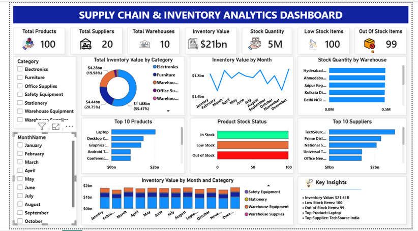

# Supply Chain & Inventory Analytics Dashboard

## 📌 Project Overview

This project is an end-to-end Supply Chain & Inventory Analytics solution built using SQL Server and Power BI.

The dashboard helps management monitor inventory levels, stock availability, supplier performance, warehouse performance, inventory value, and product demand.
## 🎯 Business Objectives

The dashboard answers key business questions such as:

- What is the current inventory level?
- Which products have low or no stock?
- Which warehouses hold the highest inventory?
- Which suppliers contribute the most inventory value?
- How does inventory value change over time?
- Which products have the highest demand?
- How much inventory value is currently tied up?

## 🛠️ Tools & Technologies

- SQL Server
- Power BI Desktop
- Power Query
- DAX
- Data Modeling
- Star Schema
- GitHub

## 📊 Key KPIs

- Total Products
- Total Suppliers
- Total Warehouses
- Inventory Value
- Stock Quantity
- Low Stock Items
- Out of Stock Items

## 📈 Dashboard Analysis

The dashboard includes:

- Inventory Value by Category
- Inventory Value by Month
- Stock Quantity by Warehouse
- Top 10 Products
- Product Stock Status
- Top 10 Suppliers
- Inventory Value by Month and Category
- Interactive Category and Month filters
- Key business insights

## 🔄 Project Workflow

Raw Data → SQL Server → Power BI → Power Query → Data Modeling → DAX Measures → Dashboard → Business Insights

## 🧩 Data Modeling

A star-schema approach was used with:

- Fact Inventory table
- Product Dimension
- Supplier Dimension
- Warehouse Dimension
- Date Dimension

Relationships were created between the fact and dimension tables to enable interactive reporting.

## 💡 Key Insights

The dashboard provides visibility into:

- Overall inventory value
- Stock availability
- Low-stock and out-of-stock products
- Product demand
- Warehouse inventory distribution
- Supplier contribution
- Monthly inventory trends

## 🖼️ Dashboard Preview

## 📁 Project Files

- `.pbix` — Power BI dashboard
- `.png` — Dashboard screenshot
- `README.md` — Project documentation

## 👤 Author

Amani Tavisi
